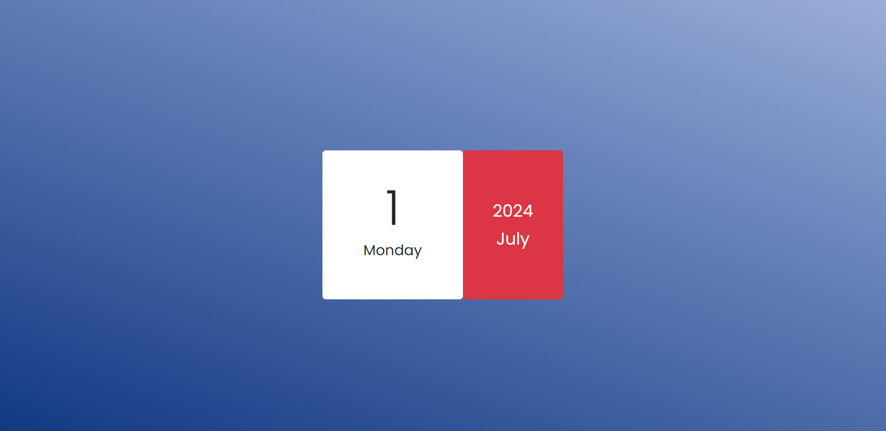

# Mini Calendar

A simple and interactive Mini Calendar application built with HTML, CSS, JavaScript, and Bootstrap. This app shows the current day, date, month, and year, and updates the date daily.

## Visit the Website

[Mini Calendar](https://maheshhattimare.github.io/mini-calendar/)

## Technologies Used

- HTML
- CSS
- JavaScript
- Bootstrap

## Screenshots

### Interface

